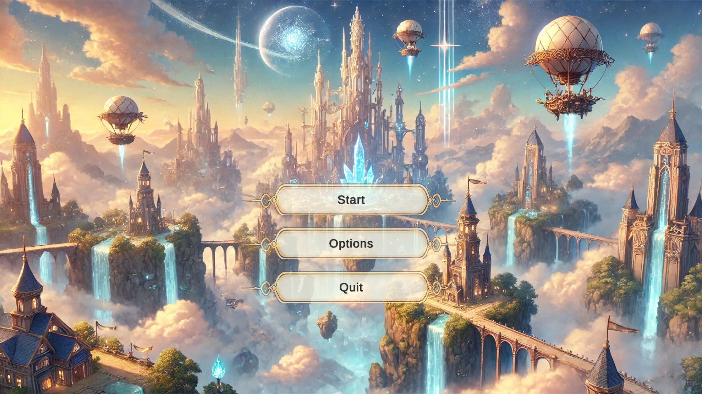
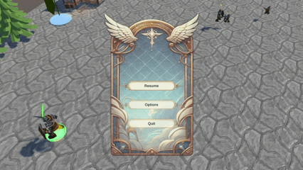
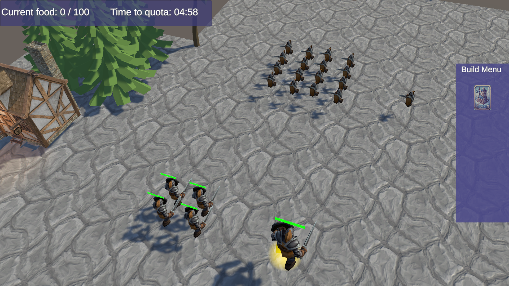

# Survive-in-the-Skies

<div align="center">
  
  
  
</div>

## Overview

**Survive-in-the-Skies** is a Unity-based real-time strategy game where players must manage resources, strategize, and survive in an aerial environment. The game emphasizes tactical decision-making and real-time mechanics set high above the ground.  

This project originated as a submission for a game jam, where we developed the core mechanics and card logic under a strictly limited timeframe. While the version here showcases those foundational systems, the game remains a work in progress. We are currently utilizing this repository as a sandbox to experiment with more advanced C# architectures, AI behaviors, and polished UI systems that weren't possible during the initial jam.

## Features

- Engaging aerial survival gameplay
- Real-time strategy elements
- Resource management and upgrades
- Unique aerial units and environments
- Player progression and challenging scenarios

## Technologies Used

- Unity Engine (C#)
- ASP.NET backend integration
- ShaderLab & HLSL for custom graphics and effects

## Getting Started

1. Clone the repository:
    ```
    git clone https://github.com/guyro85/Survive-in-the-Skies.git
    ```
2. Open the project with [Unity](https://unity.com/) (recommended version: specify if needed).
3. Build and run the game from the Unity Editor.

## Contributors

- Guy Nevo ([guyro85](https://github.com/guyro85))
- Gal Lind ([Gallind](https://github.com/Gallind))

## License

MIT License

---

*Survive, strategize, and conquer the skies!*
